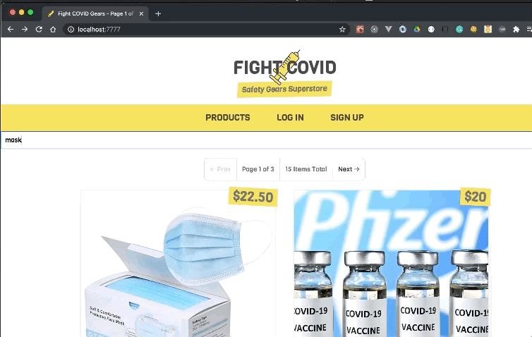
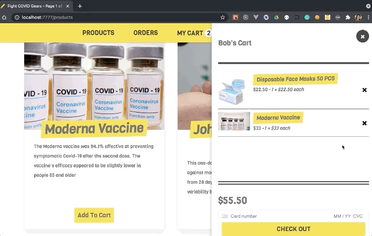

# Fight against COVID: Safety Gears Store
## Introduction
Welcome to an imaginary online shop for COVID-related safety gears. This is a full-stack web application built with **React** frameworks and **GraphQL** CRUD APIs.

## Features
- View Products: 
  - All users regarless of login status can view available products

- Search Products: 
  - All users regarless of login status can search for products by keywords (product title and description)

- Order Products: 
  - Logged-in users will see "add to cart" button at the bottom of each product that allows them to order products

- Edit Cart Items: 
  - Logged-in users can view, add or delete cart items in their own cart

- View Orders: 
  - After successfually check out the items, users can view the order of the purchase

## Tech Stack
- Front End:
  - `React.js`
  - `Next.js`
  - `Styled Components`
  - `Apollo Client`

- Back End:
  - `Keystone.js`
  - `MongoDB`
  - `Stripe`
